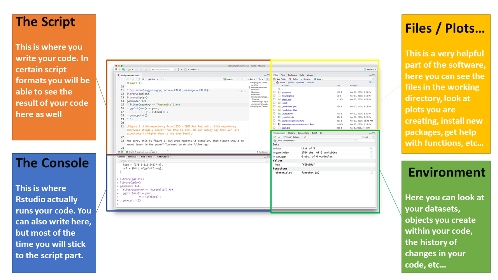
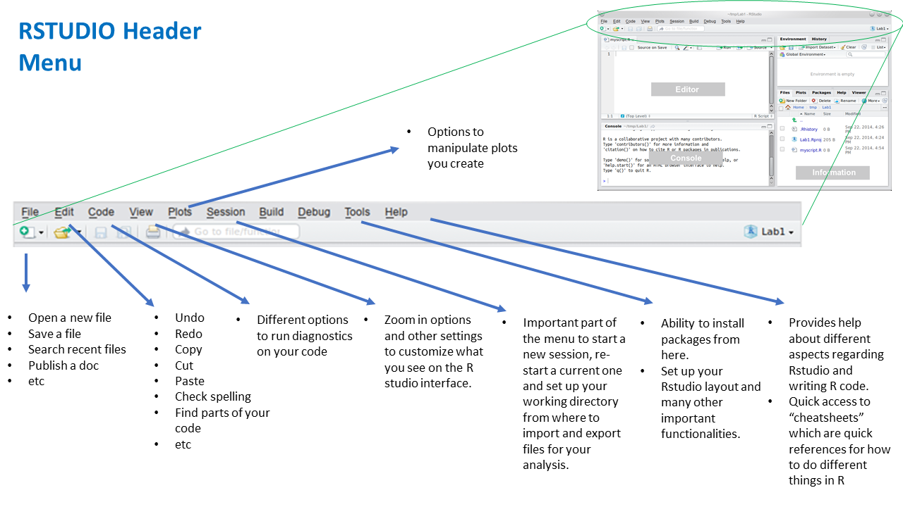

# Introduction to R - Basic Concepts

This was a 1hr workshop tailored towards S&C / performance coaches without any previous experience with R. This course provides an overview of first steps and common tasks coaches will need to complete when using R for data analysis. This was a live event, but I tried to summarise the content below in a non-technical way and hopefully easy to follow. 

Link to the course Rmd Script [here](https://github.com/josedv82/R_for_Strength_Coaches/blob/master/Rstudio%20Workshop.Rmd)
  
***  
<br>
<br>
<br>  

# What are we going to be learning

* Basic intro to R and Rstudio
* The difference between packages and functions
* Loading packages
* Importing data
* Familiarising yourself with the data
* Basic statistical operations we can perform on our data
* Creating and improving graphics
* Joining different datasets
* Basic data modeling

<br>
<br>
<br>

# Programming in R

It is important to differenciate between `R` and `RStudio`.

* R is a **programming language** use (amongst other things) for statistical analysis. It is commonly used by analysts and data scientists in different fields, including sports.  

To download R, please follow this [link.](https://cran.r-project.org/bin/windows/base/)

* RStudio is the **interface** that enables users to write R scripts in a variety of formats, often more user friendly that using R alone. It is a powerful development environment where users can organise their scripts, see outputs alongside code or even write interactive web applications.

To download the R Studio software follow this [link.](https://rstudio.com/products/rstudio/download/])

R Programming language is ~20 years old and the most recent version of the language *(Version 4.00)* was released in February 2020. On the other side Rstudio is just a few years old, but it has evolved a lot in just a few years. There are other platforms besides RStudio that can be used to write R, but Rstudio is a very common one.

To summarise the relationship between these two elements, try to think of R like the engine of the car and Rstudio like the driving wheel and dashboard from where you can control the engine.

***

<br>

#### The image below is a summary of what the Rstudio interface looks like after you install it and some of the background behind the different parts of the software.



***

<br>
<br>

#### Furthermore, the header Menu provides a variety of functionalities that you should try to get familiar with when you start using RStudio as it will help you save time.

<br>



***

<br>
<br>
<br>


# Why R?

There are a few reasons why R is a good option for statistical analysis. Some of those are:

* It is a powerful programming, statistical and graphical language that will cover most of your analytical needs.
* It is free and open source. It is constantly evolving and getting better.
* There are packages (thousands of them) that provide functions for users to perform different tasks. 
* You can write your own functions (and packages) if you want to, to suit your needs. This will simplify your code if you have to repeat certain steps a few times in your script.
* Automate your script. Unlike excel, you can fully automate your script without the need to repeat it every time you need something.
* It handles big volumes of data really well.
* You can design powerful graphics. There are some packages that can help you achieve almost anything you want.
* You can use it to create reports (like this document) or even full apps like our AMS.

<br>

Most of the above bullet points also apply to other programming languages (Python for example). But for now, we are going to focus on R and some of it possibilities.

<br>
<br>
<br>


# Packages / Functions


Packages are `group of functions` packaged together. They are also called *libraries*. There are thousands of packages in R. Some for data manipulation, some for statistical analysis, some for data visualization and even specific packages to create reports and full applications.  

`Functions perform specific taks` (*i.e: calculate the mean of a list of numbers*). They are similar to the functions you use in Excel for example. In R, functions follow the following pattern **function_name(something)**.  

One advantage of R is that users can create their own functions and packages for many different needs. 

Think of a function as a wrapper for steps you want to perform within your analysis. If you write the steps once, and wrap then within a function, then instead of repeating those steps you can just call your functions. Your call will be more organised this way.

In the near future we will learn how to write our own functions.

<br>

Let's load the packages we are going to use in this session  


```r
#to load packages use *library(package)*

library(tidyverse) #loads all the packgages in the tidyverse ecosystem
library(readxl) #loads the readxl package, which makes it easy to import xlsx files.

```

<br>

The **Tidyverse** is a very important package in R. In fact, it is more than just a package. `It is universe of packages`, meaning it loads a few packages that provide a wide array of useful functions for data analysis. It provides functions to import data, to clean, manipulate and tidy your data prior to analysis as well as for data modeling and visualization. It integrates the *ggplot2* package, which is probably one of the most important data visualization packages out there. To learn more about the Tidyverse package visit this [link.](https://www.tidyverse.org/)  
  
<br>
<br>
<br>
 

# Importing your data

Before inforting the data, download the 3 files we will be using to your working directory. 

[File 1](https://github.com/josedv82/R_Intro_Workshop/blob/master/strength.csv)  
[File 2](https://github.com/josedv82/R_Intro_Workshop/blob/master/speed.xlsx)  
[File 3](https://github.com/josedv82/R_Intro_Workshop/blob/master/power.csv)  

We are going to load the 3 datasets and give them names, so that we can call them later in the analysis process if we need to. To name something in R just follow this pattern: **name** `<-` **something**. Uou can also use `=` instead of `<-`

```r
#We will use *read.csv()* and *read_excel()* functions ro import our files. Remember the working directory in R studio has to be set to the folder where your files are, otherwise we would need to specify the full path of the file.

strength <- read.csv("strength.csv") #loading max strength data and calling it "strength"
power <- read.csv("power.csv") #loading power data and calling it "power"
speed <- read_excel("speed.xlsx") #loading running speed data and call it "speed"

```

<br>

Notice the different functions we used to import data. **"read.csv()"** is a native R function. We don't need any packages to run it.  

However, `speed is not a .csv document but a .xlsx file`, therefore we need another funtion to import this document. We use **"read_excel()"** from the `"readxl"` package, which we loaded at the beginning. 

R allows to import many different types of files, like .pdf, .txt, .csv, .tsv, .xls, etc... and it also allows to connect directly to a database. For example, we can connect directly to our team's database using specific packages for this. This way, every time we run our code we are always pulling the most updated data.
  
<br>
<br>
<br>


# Data Transformation

Now that our the data is loaded  we are ready to start working with it. Real data is always messy and you will have to do some sort of cleaning and tyding all the time. We are going to clean each of those datasets to facilitate our analysis later.  

```r

#Prepare the strength dataset
strength.C <- strength %>% 
  select(Date, Player, maxStrength = Estimated.1RM) %>% #select the columns we want
  mutate(Date = as.Date(Date, origin = "1970-01-01", format = "%m/%d/%Y")) #modify the format of the date

#prepare the power dataset
power.c <- power %>% 
  select(Date, Player, relPower = Value) %>% 
  mutate(Date = as.Date(Date, origin = "1970-01-01", format = "%m/%d/%Y"))

#prepare the speed dataset
speed.c <- speed %>% 
  select(Date, Player = player, maxSpeed = Total) %>%
  mutate(Date = as.Date(Date, origin = "1970-01-01", format = "%m/%d/%Y"))

```

<br>

We have done some data cleaning, for example we selected especific columns for each dataset using `select()`, and we also changed the name of a few columns to make them more meaningful within the *select()* function. 

Notice the *pipe* operator (**%>%**). This symbol is called `pipe`. It helps join statements in your code, in English it could be translated as **"then"**. 

On the example above you are basically saying use the dataset "speed" **and then** select the following 3 columns **and then** change the date format from text to date.

You can *pipe* your code when the Tidyverse package is loaded.
  
<br>
<br>
<br>
 

# Familiarise yourself with the data

The next two functions will let you have a quick look at your data. However, they return objects that are hard to manipulate for futher analysis. They are just useful to familiarise yourself with the data you are about to work with.

```r

#show me the structure of my data
str(power.c)

#give me a quick summary of my data
summary(power.c)

#select a specific column and then (%>%) give me summary of that column
power.c$relPower %>% summary()


```

  
<br>
<br>
<br>
 
  
# Basic Statistics


Let's look at some simple statistics. First we are going to filter the data and focus on PlayerA4 only.

```r

#filter by player
playerA4 <- power.c %>% filter(Player == "A4") 
playerA4

```

<br>  
  
    
Now we are going to run simple statistics on this data using the function **summarise**:

```r

#summarise by max power
playerA4 %>% summarize(maxPower = max(relPower))

#summarise by min power
playerA4 %>% summarise(minPower = min(relPower))

#summarise by mean power
playerA4 %>% summarise(meanPower = mean(relPower))

#summarise by sd
playerA4 %>% summarise(sdPower = sd(relPower))

#number of tests
playerA4 %>% summarise(n())

#filter by most recent test using the function slice()
playerA4 %>% slice(which.min(Date))


```

  
<br>  
    
Usually you will have to look at more than one player at a time. Let's try and do similar analysis with all players in the roster. Notice how in all the operations below we are `grouping the data set by player`, so that statistics are calulated for each player individually.

```r

#group analysis: Summarise + arrange
power.c %>%
  group_by(Player) %>%
  summarise(maxPower = max(relPower)) %>%
  arrange(desc(maxPower))


#group analysis calculating the top 3 average for each player.
power.c %>%
  group_by(Player) %>%
  top_n(3, relPower)


#3 most recent then calculate the mean
power.c %>%
  group_by(Player) %>%
  top_n(3, Date) %>%
  summarise(maxPower = max(relPower)) %>%
  arrange(desc(maxPower))


#summarise by all factor
power.c %>%
  group_by(Player) %>%
  summarise(MEAN = mean(relPower), SD = sd(relPower), MAX = max(relPower), MIN = min(relPower), N = n()) %>%
  arrange(desc(MEAN))


# create a new metric with mutate()
power.c %>%
  group_by(Player) %>%
  summarise(maxPower = max(relPower)) %>%
  arrange(desc(maxPower)) %>%
  mutate(Rank = round(rank(-maxPower),0))
```

  
<br>
<br>
<br>

    
# Data Visualization

Most times you will want to create visualizations to better understand your analysis and add to reports or to show your players/coaches. For this we are going to use the package **ggplot2** which is loaded with the Tidyverse.  

**GGplot** stands for *Grammar of Graphics*. This is one of the most powerful data visualization packages available. You can practically draw any visualization you can imagine. Because it is part of the "Tidyverse" it is already loaded into the script, so you don't have to call it again.   

If you want to learn more about **ggplot2** you can visit this [link.](https://ggplot2.tidyverse.org/)  

<br>

Let's use **playerA4** data frame for the first example. We are going to build a few visuals and tweak them to make them more impactful.  

To use ggplot we need to call the `ggplot()` function. Within the ggplot function we will add the aesthetics of the graph, i.e. the data that goes into x and y axis. Also notice that once you are within ggplot() you will have to use `+` instead of `%>%` to join your code. Let's work through it.

```r

#create bar chart showing the results of all his assessments in 2019

playerA4 %>% 
  
  filter(Date <= "2020-01-01") %>%
  
  ggplot(aes(x = Date, y = relPower)) +
  geom_bar(fill = "steelblue", stat = "identity", position = "dodge") +
  ggtitle("2019 - Player A4 Relative Power Progression - Bar chart")


#actually, a line chart showing the results of all his assessments in 2019 may be a better choice
playerA4 %>%
  
  filter(Date <= "2020-01-01") %>%
  
  ggplot(aes(x = Date, y = relPower)) +
  geom_line(color = "steelblue") +
  geom_point(color = "steelblue", size = 3) +
  ggtitle("2019 - Player A4 Relative Power Progression - Line Chart")

  

```
  
<br>   

Let's do other visualizations with the bigger dataset including all players in the sample


```r

# what is the distribution of the data

plot <- power.c %>%
  
  filter(Date <= "2020-01-01") %>%
  
  ggplot(aes(x = relPower)) +
  geom_histogram(fill = "steelblue", color = "white", binwidth = 5) +
  ggtitle("2019 - Relative Power- Histogram Chart")

plot

#Facetting by player allows to break down the graph for each player. This is called small multiples.

plot + facet_wrap(~Player)


# facetting line charts

power.c %>%
  
  filter(Date <= "2020-01-01") %>%
  
  ggplot(aes(x = Date, y = relPower)) +
  geom_line(color = "steelblue") +
  geom_point(color = "steelblue", size = 2) +
  facet_wrap(~Player) +
  ggtitle("2019 - Team1 Pitchers Relative Power Progression - Line Chart")


# boxplot charts are a good way to visualize summaries of your data. If gives you an idea of range, central tendency as well as outliers. Here we will plot each data point using *geom_jitter()* and boxplots using *geom_boxplot()*

power.c %>%
  
  filter(Date <= "2020-01-01") %>%
  
  ggplot(aes(x = Player, y = relPower)) +
  geom_jitter(color = "steelblue", size = 2, alpha = 0.5, width = 0.1) +
  geom_boxplot(alpha = 0.8, color = "darkred") +
  ggtitle("2019 - Team1 Pitchers  Relative Power - Boxplot Chart") +
  theme(axis.text.x = element_text(angle = 90))

# We can reorder the items in any order. I this case we are going to reorder by the median value

power.c %>%
  
  filter(Date <= "2020-01-01") %>%
  
  ggplot(aes(x = reorder(Player, relPower, FUN = median), y = relPower)) +
  geom_jitter(color = "steelblue", size = 2, alpha = 0.5, width = 0.1) +
  geom_boxplot(alpha = 0.8, color = "darkred") +
  ggtitle("2019 - Team1 Pitchers  Relative Power - Boxplot Chart") +
  theme(axis.text = element_text(angle = 90))

#flip the axis. Does it look better?

power.c %>%
  
  filter(Date <= "2020-01-01") %>%
  
  ggplot(aes(x = reorder(Player, relPower, FUN = median), y = relPower)) +
  geom_jitter(color = "steelblue", size = 2, alpha = 0.5, width = 0.1) +
  geom_boxplot(alpha = 0.8, color = "darkred") +
  coord_flip() +
  ggtitle("2019 - Team1 Pitchers  Relative Power - Boxplot Chart") +
  ylab("Relative Power W/BW") +
  xlab("Players")
  

```

<br>
<br>
<br>
  
    

# Joining different datasets


More often than not you will need to work with different datasets. So you will have to join data from different sources. We can achieve this using **join** statements. In the following code we are going to join our 3 data sets: Strength, Power and Speed. We will call the new dataset "all.data".  

Notice how all 3 datasets have a common variable (Player) which will be the common column we will use for joining.


```r

#first let's summarise by max values for each player for each of our assessments

st <- strength.C %>% group_by(Player) %>% summarise(maxStrength = max(maxStrength))
po <- power.c %>% group_by(Player) %>% summarise(maxPower = max(relPower))
sp <- speed.c %>% group_by(Player) %>% summarise(maxSpeed = max(maxSpeed))

#now let's join the 3 datasets. Notice all three data sets have a common variable: Player

all.data <- full_join(st, po, by = c("Player")) %>% full_join(sp, by = c("Player"))
all.data

#we can remove the NAs on the data with na.omit() 

all.data <- all.data %>% na.omit()
all.data


```


<br>
<br>
<br>
 
    
# Relationships between metrics

As you can see, by joining data from different assessments you can quickly start building physical profiles.    

<br>

The next step in our data analysis is to start looking into relationships between variables. Let's do that by looking at the correlation between strength and power. We can do this using the function *cor()*, which takes to arguments.  

```r

#correlation between power and strength using the function *cor()*

cor(all.data$maxStrength, all.data$maxPower)

```

<br>  
    
We know the correlation. Let's try and visualize it. Sometimes it can help us better understand this relationship..

```r

# let's build a scatterplot between the two variables.

all.data %>%
  
  ggplot(aes(x = maxStrength, y = maxPower)) +
  geom_point(color = "red", size = 2) +
  ggtitle("Power vs Strength Scatter Plot")


# Let's add a best fit line using geom_smooth

all.data %>%
  
  ggplot(aes(x = maxStrength, y = maxPower)) +
  geom_point(color = "red", size = 2) +
  geom_smooth(method = "lm") + 
  ggtitle("Power vs Strength Scatter Plot")

```

<br>
    
To finish this workshop, let's look at speed vs strength. Remember the data has been altered and de-identified so the correlations will not make sense, but for learning purposes:

```r

#correlation between strength and speed
cor(all.data$maxStrength, all.data$maxSpeed)

#scatterplot
all.data %>%
  
  ggplot(aes(x = maxStrength, y = maxSpeed)) +
  geom_point(color = "red", size = 2) +
  geom_smooth(method = "lm") + 
  ggtitle("Speed vs Strength Scatter Plot")


```


<br>
<br>
<br>


# What now?

There are a number of resources you can use to continue exploring R. I recommend familiarizing yourself with the **R cheatsheets**. These are one or two pages report containing simple summaries of different functions available within some of the R packages. The following should be useful:  
  
* Data Transformation [Cheatsheet](https://resources.rstudio.com/rstudio-developed/data-transformation)
* GGPLOT [Cheatsheet](https://resources.rstudio.com/rstudio-developed/data-visualization-2-1)
* Importing data [Cheatsheet](https://resources.rstudio.com/rstudio-developed/data-import)


Also, this [video](https://www.youtube.com/watch?v=lL0s1coNtRk) offers a good introduction to RStudio, the platform and different aspects you should familiarize yourself when starting to work in R.


For **GGPLOT** I found [this book](https://ggplot2-book.org/) to be really helpful to get an overall idea of what is possible with this package. The link will take you to a free copy of the book.

***
